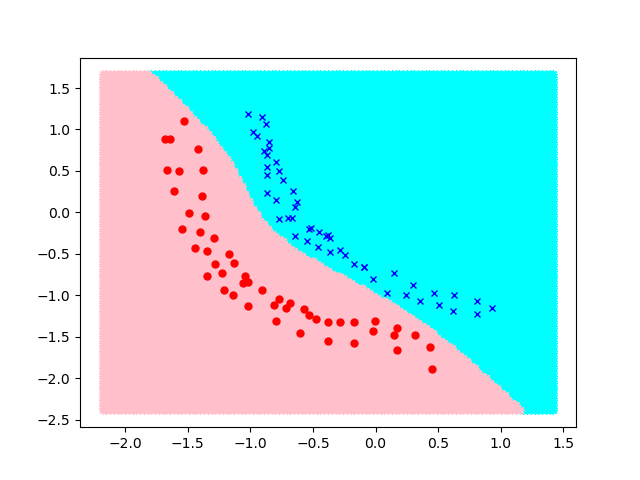
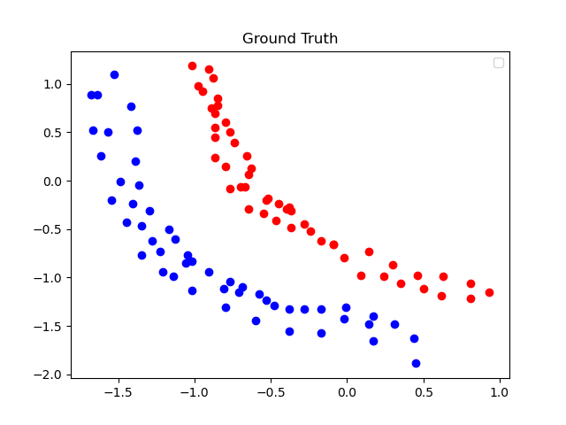

# MLP_By_Numoy
Build a MLP network only use numy and visualize the result

## Table of Contents

- [Installation](#installation)
- [Usage](#usage)
- [Documentation](#Documentation)

## Installation

1. Clone the repository.
2. Install dependencies:
You can install the package using pip:

```bash
pip install numpy
pip install matplotlib
```

## Usage:
```bash
python Train_test.py
```
- Run edge_tracking.py file to get the result:


- The Ground Truth is:


